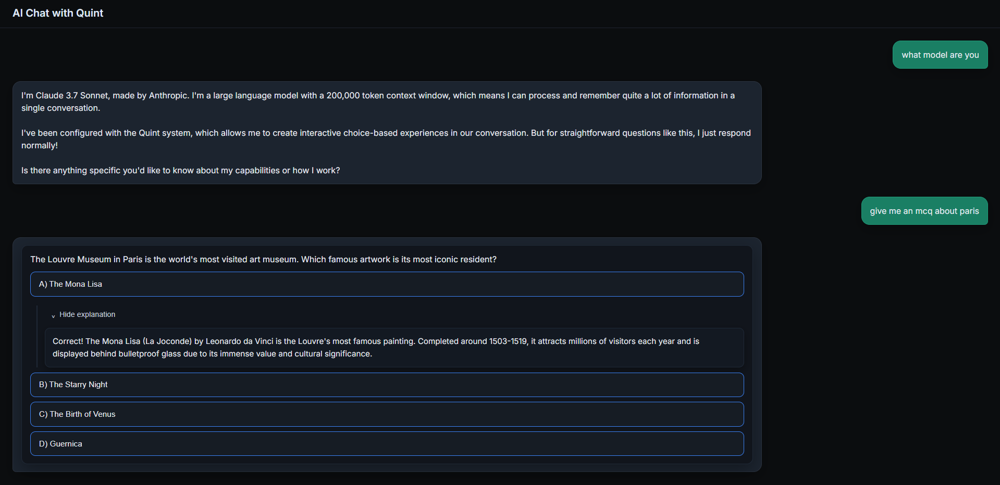
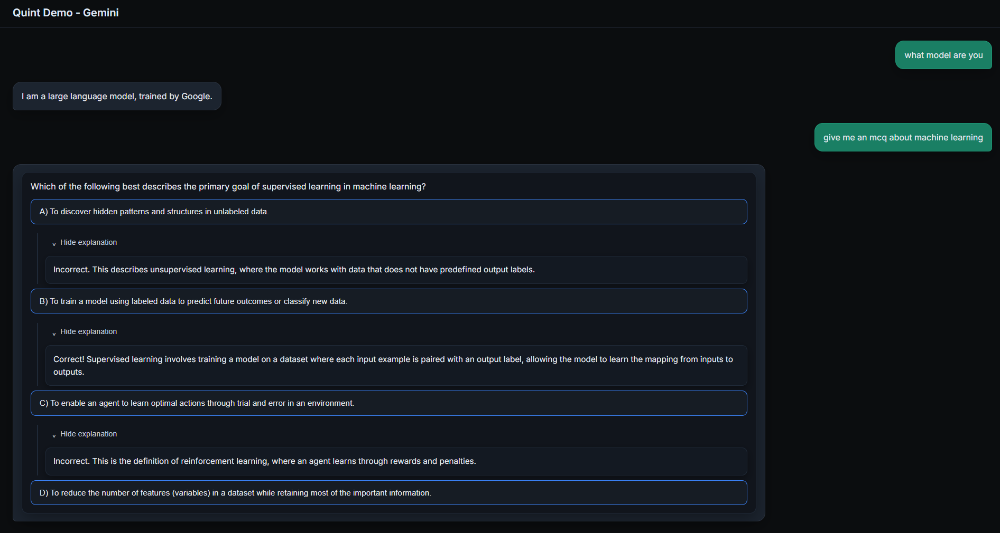

# Quint

[](https://www.npmjs.com/package/@itsm0rty/quint)
[](https://www.npmjs.com/package/@itsm0rty/quint)

**From prompts to interfaces**

Most LLM interfaces still behave like terminals. You type text in. Text comes out. Quint changes that.

Quint is a deterministic choice-and-reveal system for AI user interfaces. It gives developers explicit control over how user actions become model input, how information is revealed, and where that information appears in the interface.

Instead of treating every interaction as raw text, Quint introduces structure.

**Buttons are not just UI elements; they are decisions with intent.**

With Quint, a single user action can:

- Reveal content that already exists
- Send structured input back to an LLM
- Do both, in a predictable and localized way

This separation matters. It lets you decide:

- What the model should know
- What the user should see
- Whether output appears inline or as part of the main conversation

The result is interfaces that grow locally instead of endlessly scrolling. Explanations appear exactly where the user expects them. Roleplay branches unfold under the choices that caused them. Nothing is implicit. Nothing is accidental.

Quint is provider-agnostic and works without any LLM at all. AI is an optional layer, not a dependency.

Buttons are only the beginning. Quint is about moving LLM interaction out of the command-line era and into a UI-native one, where intent, structure, and determinism come first.

**If you are building AI products, not just prompting models, Quint is the missing layer.**

## Examples

Here are some examples of Quint buttons in action from the demo applications:






## The Problem Quint Solves

In standard chat UIs, multiple choice questions either show answers immediately (spoilers) or hide them at the bottom (breaking spatial flow). Quint fixes this by:

- **Eliminating spoilers**: Choices can reveal explanations inline without showing answers upfront
- **Preserving spatial context**: Consequences appear near the action that caused them
- **Providing deterministic control**: Developers explicitly define what goes into the model and what comes out

## Installation

```bash
npm install @itsm0rty/quint
```

**📦 [View on npm](https://www.npmjs.com/package/@itsm0rty/quint)**

## Quick Start

```tsx
import React from 'react';
import { QuintProvider, QuintRenderer, useAddBlock } from '@itsm0rty/quint';
import '@itsm0rty/quint/dist/styles.css'; // Optional: base styles
import type { Block } from '@itsm0rty/quint';

function App() {
  const addBlock = useAddBlock();

  React.useEffect(() => {
    const question: Block = {
      blockId: 'q1',
      content: 'What is 2 + 2?',
      choices: [
        {
          choiceId: 'a',
          label: 'A) 3',
          directionality: 'out',
          reveal: true,
          hiddenContent: 'Incorrect. Try again!',
        },
        {
          choiceId: 'b',
          label: 'B) 4',
          directionality: 'out',
          reveal: true,
          hiddenContent: 'Correct! 2 + 2 = 4',
        },
      ],
    };
    addBlock(question);
  }, [addBlock]);

  return (
    <QuintProvider>
      <QuintRenderer />
    </QuintProvider>
  );
}
```

## Core Concepts

### Directionality

Directionality specifies how a button interacts with the LLM:

- **`out`**: Reveals pre-supplied hidden content only. No request sent to LLM.
- **`in`**: Sends structured input to the LLM only. Response appears in normal chat area.
- **`in-n-out`**: Both sends input to LLM and reveals content locally.

### Reveal Routing

Reveal routing determines where content is rendered:

- **`reveal: false`** (default): Content appears in the global chat stream
- **`reveal: true`**: Content appears inline, under the button, in a reveal container

### Reveals

Reveals are collapsible, inline containers anchored to a choice button:

- Inserted directly below the triggering button
- Visually distinct from main chat stream
- State-preserving when collapsed
- Can contain static text, LLM-generated content, or nested blocks

### Customization

All components—buttons, blocks, reveals, and containers—are fully customizable via CSS classes and React `className`/`style` props. See the [Styling](#styling) section for details.

## API Reference

### Components

#### `QuintProvider`

Provider component that manages Quint state. Wrap your app with this.

```tsx
<QuintProvider
  onChoiceActivated={(params) => {
    // Handle choice activation
  }}
  onRevealToggle={(params) => {
    // Handle reveal toggle
  }}
>
  <YourApp />
</QuintProvider>
```

#### `QuintRenderer`

Renders all blocks, choices, and reveals in the linear order.

```tsx
<QuintRenderer />
```

### Hooks

#### `useAddBlock()`

Adds a new block to the rendering state.

```tsx
const addBlock = useAddBlock();
addBlock({
  blockId: 'q1',
  content: 'Question text',
  choices: [...],
});
```

#### `useUpdateRevealContent()`

Updates a reveal with LLM-generated content.

```tsx
const updateRevealContent = useUpdateRevealContent();
updateRevealContent('blockId:choiceId', 'Generated explanation');
```

#### `useQuintItems()`

Gets all current render items.

```tsx
const items = useQuintItems();
```

### Advanced Components

#### `BlockRenderer`

Renders a single block with its choices and reveals. Useful for custom rendering logic.

```tsx
import { BlockRenderer } from '@itsm0rty/quint';

<BlockRenderer block={myBlock} />
```

#### `ChoiceButton`

Renders a single choice button. Useful for custom button styling or behavior.

```tsx
import { ChoiceButton } from '@itsm0rty/quint';

<ChoiceButton choice={myChoice} blockId="block-1" />
```

#### `RevealContainer`

Renders a reveal container. Typically used internally by `BlockRenderer`, but exported for advanced customization.

```tsx
import { RevealContainer } from '@itsm0rty/quint';

<RevealContainer reveal={myReveal} />
```

### Types

```tsx
interface Block {
  blockId: string;
  content?: string;
  choices: Choice[];
  metadata?: Record<string, unknown>;
}

interface Choice {
  choiceId: string;
  label: string;
  directionality: 'out' | 'in' | 'in-n-out';
  reveal: boolean;
  hiddenContent?: string;
  inputData?: Record<string, unknown>;
  metadata?: Record<string, unknown>;
}

interface QuintConfig {
  onChoiceActivated?: OnChoiceActivated;
  onRevealToggle?: OnRevealToggle;
  renderers?: {
    block?: (block: Block) => React.ReactNode;
    choice?: (choice: Choice, blockId: BlockId) => React.ReactNode;
    reveal?: (reveal: Reveal) => React.ReactNode;
  };
}
```

## Examples

### Minimal MCQ (15 lines)

```tsx
import React from 'react';
import { QuintProvider, QuintRenderer, useAddBlock } from '@itsm0rty/quint';

function App() {
  const addBlock = useAddBlock();
  React.useEffect(() => {
    addBlock({
      blockId: 'q1',
      content: 'What is the capital of France?',
      choices: [
        { choiceId: 'a', label: 'A) London', directionality: 'out', reveal: true, hiddenContent: 'Incorrect.' },
        { choiceId: 'c', label: 'C) Paris', directionality: 'out', reveal: true, hiddenContent: 'Correct!' },
      ],
    });
  }, [addBlock]);
  return <QuintProvider><QuintRenderer /></QuintProvider>;
}
```

### Non-Spoiler MCQ (Full Example)

```tsx
const question: Block = {
  blockId: 'q1',
  content: 'What is the capital of France?',
  choices: [
    {
      choiceId: 'a',
      label: 'A) London',
      directionality: 'out',
      reveal: true,
      hiddenContent: 'Incorrect. London is the capital of England.',
    },
    {
      choiceId: 'c',
      label: 'C) Paris',
      directionality: 'out',
      reveal: true,
      hiddenContent: 'Correct! Paris is the capital of France.',
    },
  ],
};
```

For **MCQs**, it's generally best to:

- Use **`directionality: 'out'`** with **`reveal: true`**  
  - Feedback comes from `hiddenContent` only  
  - No extra LLM calls on button click (cheaper, faster, deterministic)
- Reserve **`'in'` / `'in-n-out'`** for flows where you truly need the model to react to the click (e.g. follow‑up tutoring, story branching).

### Roleplay with Local Descriptions

```tsx
const scene: Block = {
  blockId: 'scene1',
  content: 'You stand at the entrance of an ancient temple.',
  choices: [
    {
      choiceId: 'inspect',
      label: 'Inspect the entrance',
      directionality: 'in-n-out',
      reveal: true,
      hiddenContent: 'You notice ancient runes carved into the stone.',
      inputData: { action: 'inspect_entrance' },
    },
  ],
};
```

### Tutoring with Inline Hints

```tsx
const problem: Block = {
  blockId: 'math1',
  content: 'Solve: 2x + 5 = 13',
  choices: [
    {
      choiceId: 'hint',
      label: 'Get a hint',
      directionality: 'in-n-out',
      reveal: true,
      inputData: { type: 'hint_request' },
    },
  ],
};

// In your onChoiceActivated handler:
if (params.inputData?.type === 'hint_request') {
  const hint = await fetchHintFromLLM(params);
  updateRevealContent(`${params.blockId}:${params.choiceId}`, hint);
}
```

## Styling

Quint includes base CSS classes. Import the default styles:

```tsx
import '@itsm0rty/quint/dist/styles.css';
```

### CSS Class Overrides

You can override styles using the provided class names:

- `.quint-container` - Main container
- `.quint-block` - Content block
- `.quint-block-content` - Block text content
- `.quint-choices` - Choices container
- `.quint-choice-button` - Individual choice buttons
- `.quint-reveal-container` - Reveal container
- `.quint-reveal-toggle` - Reveal toggle button
- `.quint-reveal-content` - Reveal content area
- `.quint-reveal-text` - Reveal text content

### Style and className Props

All components support standard React `className` and `style` props for customization:

```tsx
import { BlockRenderer, ChoiceButton, QuintRenderer } from '@itsm0rty/quint';

// Customize block styling
<BlockRenderer
  block={myBlock}
  className="my-custom-block"
  style={{ background: '#f0f0f0', borderRadius: '20px' }}
  contentClassName="my-content"
  choicesClassName="my-choices"
/>

// Customize button styling
<ChoiceButton
  choice={myChoice}
  blockId="block-1"
  className="my-button"
  style={{ 
    background: 'linear-gradient(45deg, #fe6b8b 30%, #ff8e53 90%)',
    color: 'white',
    fontWeight: 'bold'
  }}
/>

// Customize container
<QuintRenderer
  className="my-container"
  style={{ padding: '2rem' }}
/>
```

The props merge with default styles, so you can override specific properties while keeping others.

## What Quint Is Not

Quint is purposefully narrow. It is **not**:

- A chat framework
- An AI SDK or provider client
- A prompt orchestration or RAG system
- An agent runtime or tool router

Quint assumes you already have:
- Conversation history management
- Model communication
- Retry/rate limiting logic

Quint slots in as the layer that turns decisions into explicit UI choices and localized reveals.

---

**Building AI products means thinking beyond the prompt. Quint gives you the structure to make that happen.**

## Examples and Demos

See `/demo` for complete working examples with Gemini, OpenAI (ChatGPT), and Claude. Each demo is self-contained and shows provider-specific integration patterns.

**Note:** The demos require API keys and are not part of the core library package. They are provided for reference only.

## Stability and Versioning

Quint is currently in a **0.x** phase. The core ideas are stable, but the API may evolve based on real-world usage.

- **No hard stability guarantees yet** – minor versions may include breaking changes
- **Invalid configurations** are surfaced as **runtime warnings in development**, not hard compile-time errors

If you need a pinned, long-term stable API, consider vendoring the current version.

## License

MIT

## Contributing

Contributions welcome! Please open an issue or PR.

